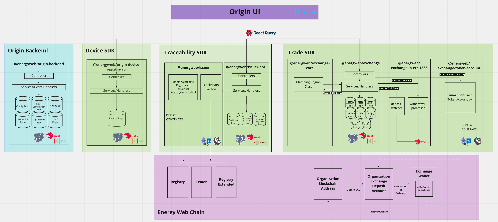

# Energy Web Origin Architecture
Energy Web Origin is comprised of a user interface, a backend, and multiple SDKs that can be used individually, or in conjunction with each other. Each SDK is composed of one or several NPM packages. 

 ## SDK API Packages
Each SDK has an API package:  

- [Device Registry API](./device-registry/device-registry-api.md) (@energyweb/origin-device-registry-api)
- [Issuer API](./traceability/packages/issuer-api.md) (@energyweb/issuer-api)
- [Exchange API](./trade/exchange.md) (@energyweb/exchange)  

The API package has one or several NestJS modules in the /pods directory. Each module contains code relevant for a specific feature. In general, each NestJS module has:  

+ A [controller](https://docs.nestjs.com/controllers) that manages requests and responses to the client
+ A .entity file that maps an entity to the database repository
+ A .service file that provides methods to fetch and transform data
+ [Data Transfer Object (DTO) file(s)](https://docs.nestjs.com/controllers#request-payloads) that provide Data Transfer Objects, which are representations of the data that are exposed to the endpoint consumer  
+ A [module](https://docs.nestjs.com/modules) class that is used by NestJS to structure the application 

### Data Persistence
API services fetch, update and persist data. Data is persisted using [PostgreSQL](https://www.postgresql.org/), and [TypeORM](https://typeorm.io/#/) is used to integrate the database into the NestJS application. You can view the SDK's database connection configuration in each SDK's typmeorm.ts file. 

### Events and Commands
In addition to services, the NestJS modules use [Commands](https://docs.nestjs.com/recipes/cqrs#commands) and [Events](https://docs.nestjs.com/recipes/cqrs#events) to encapsulate logic and, in the case of an event, respond asynchronously to something that has occured in the application. Events and commands are emitted and responded to within and between an SDK's packages using the [NestJS CQRS module](https://docs.nestjs.com/recipes/cqrs). 

## Smart Contracts
The Issuer (@energyweb/issuer) and Exchange Token Account (@energyweb/exchange-token-account) packages contain their respective SKD's smart contracts. 

- See documentation for Issuer smart contracts [here](./traceability/contracts/Issuer.md#smart-contracts)
- See documentation for the Exchange Token Account smart contract [here](./trade/exchange-token-account.md)

### Deployment
The Issuer and Exchange Token Account packages use [Truffle to compile](https://trufflesuite.com/docs/truffle/getting-started/compiling-contracts.html) and migrate smart contracts. 

### Blockchain Libraries
- Packages use [ethers](https://docs.ethers.io/v5/) to interact with smart contracts on the blockchain.  

- The Issuer and Exchange Token Account packages use [typechain](https://github.com/dethcrypto/TypeChain#readme) to generate TypeScript classes for smart contracts.

